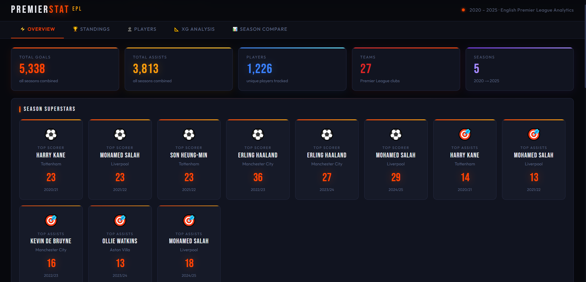
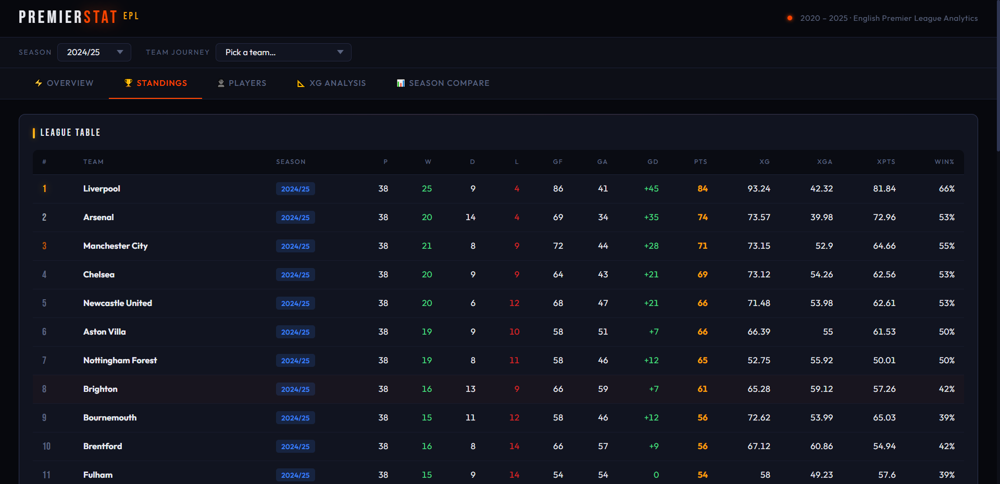
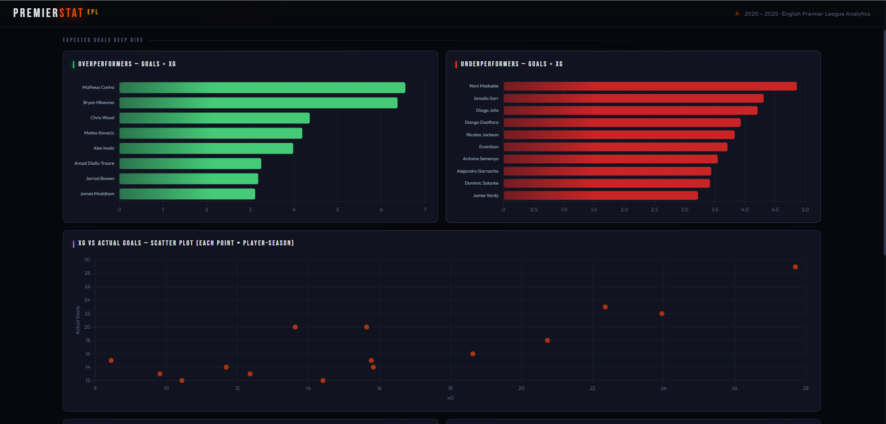

# PremierStat — English Premier League Analytics Dashboard

> A full-stack football analytics platform covering **5 EPL seasons (2020–2025)**, built with Python, Flask, SQL Server, and Chart.js. Designed to surface deep insights on players, teams, and expected goals across one of the world's most competitive leagues.

---

## Screenshots

### Overview — KPIs & Season Superstars


### Standings — Full League Table with xG Metrics


### Players — Sortable Stats Database + Performance Charts


### xG Analysis — Overperformers, Scatter Plot & Bubble Chart


---

## What This Project Does

PremierStat is an interactive analytics dashboard that transforms raw Premier League CSV data into a rich, filterable visual experience. It covers **5 complete seasons**, **27 clubs**, **1,226 unique players**, and over **5,300 goals**.

Every section is filterable by season, and the data is stored in a relational SQL Server database with clean normalized tables.

---

## Dashboard Tabs

| Tab | What you'll find |
|-----|-----------------|
| **⚡ Overview** | KPI cards · Season superstars · Top scorers/assists · Goals trend by season · xG per 90 leaders |
| **🏆 Standings** | Full league table · Points & win rate charts · xG vs actual goals · Goal difference · Best defences |
| **👤 Players** | Searchable + sortable player database · Top scorers/assists/G+A · xG90 & xA90 charts |
| **📐 xG Analysis** | Overperformers vs underperformers · xG scatter plot · Bubble chart · Clinical finisher ratio |
| **📊 Season Compare** | Golden Boot per season · Goals trend · Top 5 teams points race · Team journey tracker |

---

## Tech Stack

| Layer | Technology |
|-------|-----------|
| **Backend** | Python 3, Flask |
| **Database** | Microsoft SQL Server (LocalDB) |
| **ORM / DB Driver** | pyodbc, pandas |
| **Frontend** | HTML5, CSS3, Vanilla JavaScript |
| **Charts** | Chart.js 4.4 |
| **Fonts** | Bebas Neue, Outfit (Google Fonts) |
| **Data Source** | Real EPL CSV data (2020/21 – 2024/25) |

---

## Database Schema

```
Seasons         — SeasonID, SeasonName
Teams           — TeamID, TeamName
Players         — PlayerID, PlayerName, TeamID
PlayerStats     — PlayerID, SeasonID, Apps, Minutes, Goals, Assists, xG, xA, xG90, xA90
TeamSeasonStats — TeamID, SeasonID, Matches, Wins, Draws, Loses, Goals, GoalsAgainst, Points, xG, xGA, xPTS
```

---

## Getting Started

### 1. Clone the repository

```bash
git clone https://github.com/your-username/premierstat.git
cd premierstat
```

### 2. Install dependencies

```bash
pip install flask pyodbc pandas
```

### 3. Set up the database

Make sure SQL Server LocalDB is installed, then create a database called `PremierLeagueDB`.

### 4. Configure your CSV folder path

Open `insert_data.py` and update the folder path and file name mapping at the top of the file:

```python
FOLDER = r"C:\path\to\your\csv\files"

SEASON_MAP = {
    '2020/21': ('league-chemp.csv',    'league-players.csv'),
    '2021/22': ('league-chemp (1).csv','league-players (1).csv'),
    ...
}
```

### 5. Insert the data

```bash
python insert_data.py
```

You'll see a progress log like:

```
 TeamSeasonStats table ready
  Clearing old data...
 Inserting seasons...
   → 2020/21 (ID=1)
   → 2021/22 (ID=2)
   ...
 IMPORT COMPLETE in 4.2s
```

### 6. Run the server

```bash
python Visual.py
```

### 7. Open the dashboard

```
http://127.0.0.1:5000
```

---

## API Endpoints

All endpoints support `?season_id=` for season filtering.

| Endpoint | Description |
|----------|-------------|
| `/api/seasons` | All available seasons |
| `/api/teams` | All teams |
| `/api/kpis` | Total goals, assists, players, teams |
| `/api/top-scorers` | Top 15 goal scorers |
| `/api/top-assists` | Top 15 assist providers |
| `/api/top-contributions` | Top 15 by G+A combined |
| `/api/goals-per-team` | Total goals per team |
| `/api/team-standings` | Full standings with xG metrics |
| `/api/goals-conceded` | Goals conceded per team |
| `/api/xg-analysis` | xG overperformers and underperformers |
| `/api/top-scorer-per-season` | Golden Boot winner each season |
| `/api/top-assists-per-season` | Top assist provider each season |
| `/api/season-compare` | All team data across all seasons |
| `/api/team-season-performance` | Single team journey across seasons |
| `/api/efficiency` | Minutes per goal leaders |
| `/api/all-players` | Full player database |

---

## Project Structure

```
premierstat/
├── Visual.py           # Flask backend — all API endpoints
├── insert_data.py      # Data import script — reads CSVs, populates DB
├── templates/
│   └── dashboard.html  # Full frontend — charts, tables, filters
├── data/               # Your CSV files go here
│   ├── league-chemp.csv
│   ├── league-players.csv
│   └── ...
├── screenshots/
│   ├── overview.png
│   ├── standings.png
│   ├── players.png
│   └── xg_analysis.png
└── README.md
```

---

## Data Coverage

| Metric | Value |
|--------|-------|
| Seasons covered | 5 (2020/21 → 2024/25) |
| Teams tracked | 27 |
| Unique players | 1,226 |
| Total goals | 5,338 |
| Total assists | 3,813 |
| Player-season records | ~4,000+ |

---

## Key Features

- **Season filter** — every chart and table updates when you switch seasons
- **Sortable tables** — click any column header to sort instantly
- **Live search** — filter the player database in real time
- **Team Journey** — track any team's points, goals, and defence across 5 seasons
- **xG Bubble Chart** — visualise the most dangerous and creative players per 90 minutes
- **Clinical Finisher Ratio** — Goals ÷ xG to find players who outperform their expected output
- **Dark lava theme** — designed for readability and portfolio presentation

---

## License

This project is for educational and portfolio purposes. EPL data sourced from publicly available statistics.

---

> Built by [Abdallah Bayoumy] · [LinkedIn](https://linkedin.com/in/abdallah-bayoumy) · [GitHub](https://github.com/abdallah-mbayoumy)