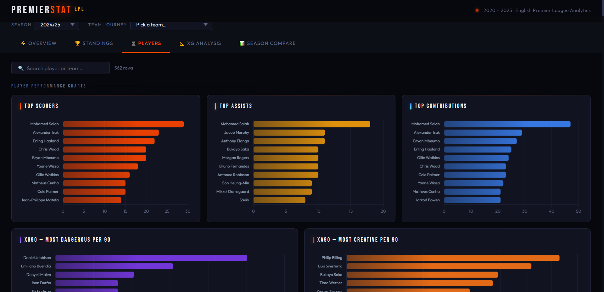

# PremierStat — English Premier League Analytics Dashboard

> A full-stack football analytics platform covering **5 EPL seasons (2020–2025)**, built with Python, Flask, SQL Server, and Chart.js. Powered by real FBref and league CSV data across 27 clubs and 1,226 unique players.

---

## Screenshots

### Overview — KPIs & Season Superstars


### Standings — Full League Table with xG Metrics


### Players — Sortable Stats Database + Performance Charts


### xG Analysis — Overperformers, Scatter Plot & Bubble Chart


---

## What This Project Does

PremierStat transforms raw Premier League data into a rich, interactive analytics dashboard. It covers **5 complete seasons**, **27 clubs**, **1,226 unique players**, and over **5,300 goals** — all filterable by season with real-time chart updates.

Data is sourced from real league CSVs and FBref (shooting stats, player positions, possession, discipline, fixture results) and stored in a normalized SQL Server database.

---

## Dashboard Tabs

| Tab | What you'll find |
|-----|-----------------|
| **Overview** | KPI cards · Season superstars · Goals vs Assists by team · Possession vs Points scatter · Goals trend · Avg attendance |
| **Standings** | Full league table · Win/Draw/Loss doughnut · Home vs Away wins · Shots vs Shots on Target · Discipline cards · Penalties · Goal difference |
| **Players** | Searchable + sortable player database · Top scorers/assists/G+A · xG90 & xA90 leaders · Yellow/Red cards per player |
| **xG Analysis** | Overperformers vs underperformers · xG scatter plot · xG90 vs xA90 bubble chart · Clinical finisher ratio · Creative leaders |
| **Positions** | Goals/Assists/Minutes/G+A by position (doughnut) · xG90 by position · Discipline by position · Best player per position |
| **Season Compare** | Golden Boot per season · Points trend top 5 teams · Goals & assists by season · Avg goals per game · Team journey tracker |

---

## Tech Stack

| Layer | Technology |
|-------|-----------|
| **Backend** | Python 3, Flask |
| **Database** | Microsoft SQL Server (LocalDB) |
| **DB Driver** | pyodbc, pandas |
| **Frontend** | HTML5, CSS3, Vanilla JavaScript |
| **Charts** | Chart.js 4.4 (Bar, Line, Doughnut, Scatter, Bubble) |
| **Fonts** | Bebas Neue, Outfit (Google Fonts) |
| **Data Sources** | Real EPL CSVs + FBref (shooting, fixtures, player stats) |

---

## Database Schema

```
Seasons              — SeasonID, SeasonName
Teams                — TeamID, TeamName
Players              — PlayerID, PlayerName, TeamID
PlayerStats          — PlayerID, SeasonID, Apps, Minutes, Goals, Assists, xG, xA, xG90, xA90
PlayerExtendedStats  — PlayerID, SeasonID, Position, Nation, Age, Starts, YellowCards, RedCards, Penalties
TeamSeasonStats      — TeamID, SeasonID, Matches, Wins, Draws, Loses, Goals, GoalsAgainst, Points, xG, xGA, xPTS
TeamExtendedStats    — TeamID, SeasonID, Possession, Shots, ShotsOnTarget, ShotAccuracy,
                       YellowCards, RedCards, Penalties, HomeWins, AwayWins, AvgAttendance ...
```

---

## Getting Started

### 1. Clone the repository

```bash
git clone https://github.com/abdallah-mbayoumy/Visualbod.git
cd Visualbod
```

### 2. Install dependencies

```bash
pip install flask pyodbc pandas
```

### 3. Set up the database

Make sure **SQL Server LocalDB** is installed, then create a database in SSMS:

```sql
CREATE DATABASE PremierLeagueDB;
```

### 4. Organize your data files

Place your CSV files in subfolders inside the `premuier league/` directory:

```
premuier league/
├── 2020-2021/
│   ├── league-chemp.csv
│   ├── league-players.csv
│   ├── 2020-2021 Premier League Player Stats _ FBref.com.csv
│   └── 2020-2021 Premier League Scores & Fixtures _ FBref.com.csv
├── 2021-2022/
│   ├── league-chemp (1).csv
│   ├── league-players (1).csv
│   ├── 2021-2022 Premier League Shooting Stats _ FBref.com.csv
│   └── 2021-2022 Premier League Scores & Fixtures _ FBref.com.csv
├── 2022-2023/  ...
├── 2023-2024/  ...
└── 2024-2025/
    ├── league-chemp (4).csv
    ├── league-players (4).csv
    ├── 2024-2025 Premier League Player Stats _ FBref.com.csv
    └── 2024-2025 Premier League Scores & Fixtures _ FBref.com.csv
```

### 5. Run the data import

```bash
python insert_data.py
```

The script shows a pre-flight check of every file found, then asks for confirmation. Expected output:

```
IMPORT COMPLETE in 2.3s
  Seasons : 5
  Teams   : 27
  Players : 1,226
```

### 6. Start the server

```bash
python Visual.py
```

### 7. Open the dashboard

```
http://127.0.0.1:5000
```

---

## API Endpoints

All endpoints support `?season_id=` for season filtering.

| Endpoint | Description |
|----------|-------------|
| `/api/seasons` | All seasons |
| `/api/teams` | All teams |
| `/api/kpis` | Total goals, assists, players, teams |
| `/api/top-scorers` | Top 15 goal scorers |
| `/api/top-assists` | Top 15 assist providers |
| `/api/top-contributions` | Top 15 by G+A |
| `/api/all-players` | Full player database with position & cards |
| `/api/goals-per-team` | Total goals per team |
| `/api/team-standings` | Full standings with xG, possession, home/away |
| `/api/goals-conceded` | Goals conceded per team |
| `/api/team-shooting` | Shots, SoT, shot accuracy per team |
| `/api/team-discipline` | Yellow/red cards, penalties per team |
| `/api/team-home-away` | Home vs away record + attendance |
| `/api/attendance` | Average attendance per team |
| `/api/possession` | Possession % vs points |
| `/api/xg-analysis` | xG over/underperformers |
| `/api/position-stats` | Aggregated stats by position |
| `/api/position-leaders` | Best player per position |
| `/api/top-scorer-per-season` | Golden Boot winner each season |
| `/api/top-assists-per-season` | Top assist each season |
| `/api/season-compare` | All team data across all seasons |
| `/api/team-season-performance` | Single team journey across seasons |
| `/api/efficiency` | Minutes per goal leaders |

---

## Project Structure

```
Visualbod/
├── Visual.py              # Flask backend — all API endpoints
├── insert_data.py         # Data import script — reads CSVs, populates DB
├── templates/
│   └── dashboard.html     # Full frontend — 6 tabs, charts, tables, filters
├── premuier league/       # Data folder (subfolders per season)
│   ├── 2020-2021/
│   ├── 2021-2022/
│   ├── 2022-2023/
│   ├── 2023-2024/
│   └── 2024-2025/
├── screenshots/
│   ├── overview.png
│   ├── standings.png
│   ├── players.png
│   └── xg_analysis.png
└── README.md
```

---

## Data Coverage

| Metric | Value |
|--------|-------|
| Seasons | 5 (2020/21 → 2024/25) |
| Teams | 27 |
| Unique players | 1,226 |
| Total goals | 5,338 |
| Total assists | 3,813 |
| Player-season records | ~2,747 |
| Data sources | League CSVs + FBref |

---

## Key Features

- **Season filter** — every chart and table updates instantly when season changes
- **Sortable tables** — click any column header to sort ascending/descending
- **Live search** — filter the player database in real time by name or team
- **FBref-style tooltips** — hover any `?` icon or table column header to see the exact metric definition
- **Position analysis** — goals, assists, minutes, discipline broken down by FW / MF / DF / GK
- **xG Bubble Chart** — xG90 vs xA90 with bubble size = actual goals scored
- **Clinical Finisher Ratio** — Goals ÷ xG to identify players who outperform expected output
- **Home vs Away splits** — win records and goals per team at home vs on the road
- **Attendance tracking** — average crowd size per club per season from FBref fixture data
- **Team Journey** — track any team's points, goals and defence across all 5 seasons
- **Dark lava theme** — designed for readability and portfolio presentation

---

## License

This project is for educational and portfolio purposes.
EPL data sourced from publicly available statistics (FBref, league CSVs).

---

> Built with by **Abdallah Mbayoumy** · [GitHub](https://github.com/abdallah-mbayoumy)
